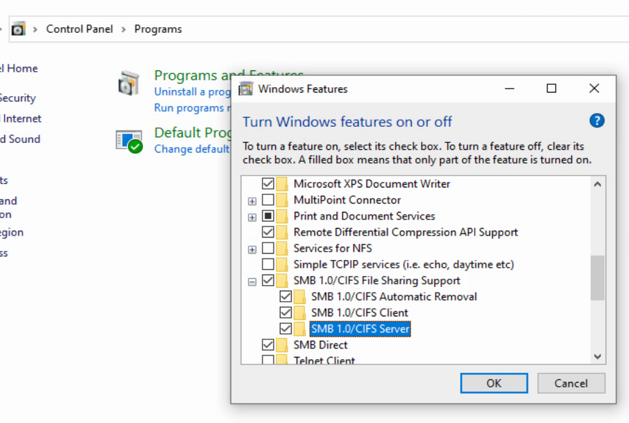
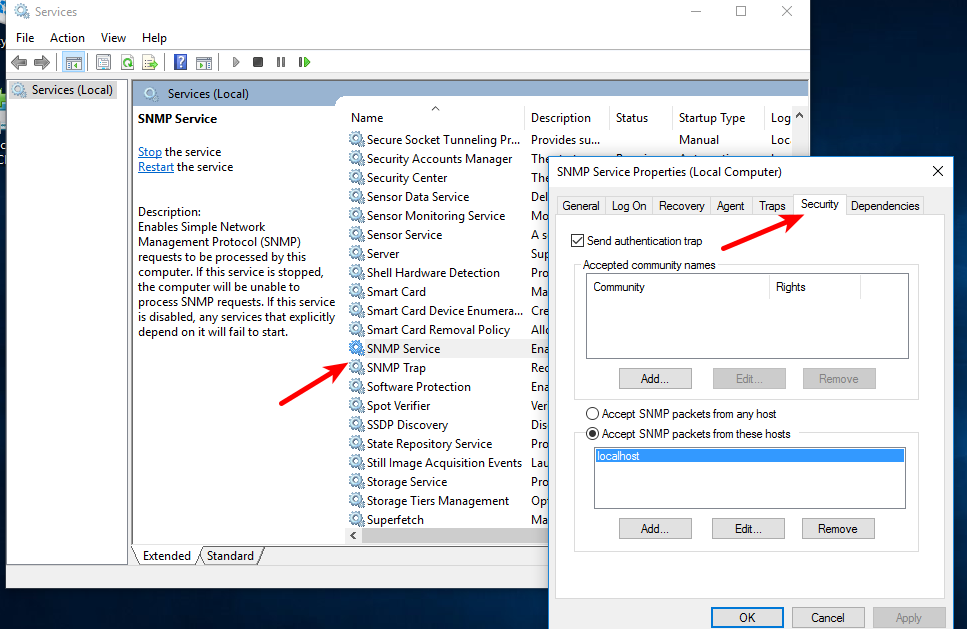
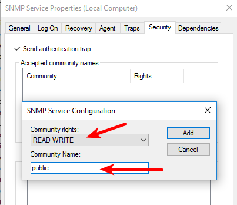
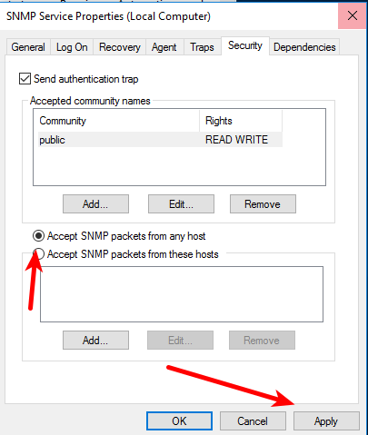
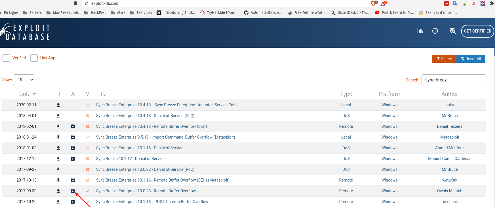
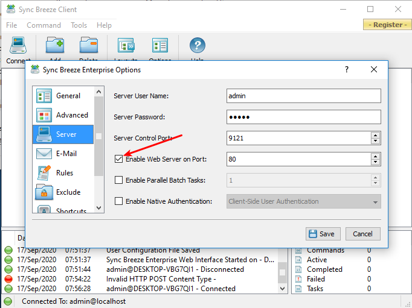
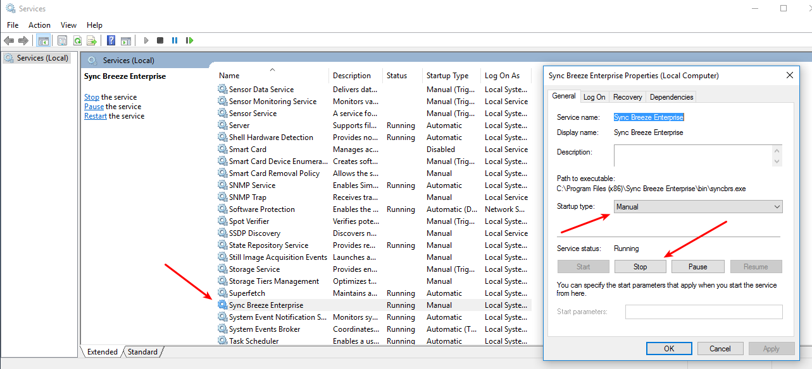

# Configuration de Windows cible

## Informations

Voici les étapes pour préparer une VM Windows 10 vulnérable.

### Étape 1 : installation de Windows  

Vous devez récupérer un ISO de Windows 10, vous avez plusieurs liens possibles :

- Lien Microsoft : <https://www.microsoft.com/en-us/software-download/windows10ISO>.  

- Faire une recherche sur <https://archive.org/>.  

Faire une installation de Windows 10 en Host Only ou en NAT.  

Utilisez un mot de passe simple comme `Passw0rd!` pour votre utilisateur.  

Lors de l'installation, vous pouvez ignorer la clé d'enregistrement. Votre Windows 10 sera fonctionnel pour au moins 30 jours. Également, vous ne devez pas le mettre à jour. (Si vous voulez activer votre Windows : <https://github.com/massgravel/Microsoft-Activation-Scripts>).

### Étape 2 : post installation

Une fois l'installation terminée, désactiver le coupe-feu.  

Dans **Settings/System/Power & sleep**, modifier **Screen et Sleep** pour **Never**. Cette configuration est optionnelle, mais très utile.

Désactiver les mises à jour : <https://monovm.com/blog/disable-windows-update-from-group-policy/>.

Vous pouvez aussi ajouter le script suivant à votre Desktop pour arrêter et nettoyer Windows Update :

```bash
@Echo On
net stop wuauserv
rmdir %Windir%\SoftwareDistribution /s /q
pause
``` 

### Étape 3 : installation de logiciels et configurations  

**Java**  

Vous allez devoir installer Java pour XAMPP. Faire une recherche sur Internet pour « Download Java for Windows ».

**SMB 1.0**  

À partir de **Control Panel-\>Programs-Programs and Features -\> Turn Windows features on or off**, activez tout pour SMB 1.0/CIFS File Sharing Support.  

  
**Image 1 : activer SMB 1.0/CIFS.**

**Partage**  

Créez un dossier sur le bureau (Desktop) et activez le partage à tout le monde (Everyone, Full Control) sur ce dossier. Au niveau de l'onglet de Security, ajoutez tout le monde avec le plein contrôle (Everyone, Full Control).

**XAMPP**  

Télécharger XAMPP au lien <https://sourceforge.net/projects/xampp/files/XAMPP%20Windows/7.2.9/> et l'installer. Ne lancez pas les services. Vous lacerez les services au besoin.    

**SNMP**  

À partir de **Control Panel-\>Programs-Programs and Features -\> Turn Windows features on or off**, activez tout pour Simple Network Management Protocol (SNMP). Si l'option n'est pas présente : <https://theitbros.com/snmp-service-on-windows-10/>. Vous aurez besoin d'un accès Internet, donc soyez certains d'avoir désactivé les mises à jour automatique avant.

Allez dans les services, ouvrez **SNMP Service** et cliquez sur l'onglet **Security**.

  
**Image 2 : configuration de SNMP.**

Sous **Accepted community names**, cliquez sur **Add** et ajoutez la "community" **public** en **READ WRITE**.

  
**Image 3 : community public.**

Cliquez sur **Accept SNMP packets from any host**.  

  
**Image 4 : Accept SNMP packets from any host**

Cliquez sur **Apply** et **OK**. Fermez les fenêtres des Services.

**Sync Breeze vulnérable**  

Téléchargez **Sync Breeze Enterprise 10.0.28 - Remote Buffer Overflow** sur le site <https://www.exploit-db.com/>. Cliquez sur l'icône carrée avec une flèche.

  
**Image 5 : Sync Breeze Entreprise 10.0.28.**

**Installer Sync Breeze seulement lorsque vous en aurez besoin et avant de l'installer, je vous recommande de prendre un snapshot de votre VM.** Le Sync Breeze que vous avez téléchargé est une version d'évaluation de 30 jours.

Une fois installé, ouvrez le client « Sync Breeze Client », ouvrez les options **Tools-\>Advanced Options** et choisir **Server**. Activez le serveur Web.  

  
**Image 6 : activation du serveur Web de Sync Breeze.**

Allez dans les services, mettre le service Sync Breeze Entreprise à **Manual** et arrêtez le service. Vous lancerez le service au besoin.

  
**Image 7 : Arrêt de Sync Breeze dans les services.**
