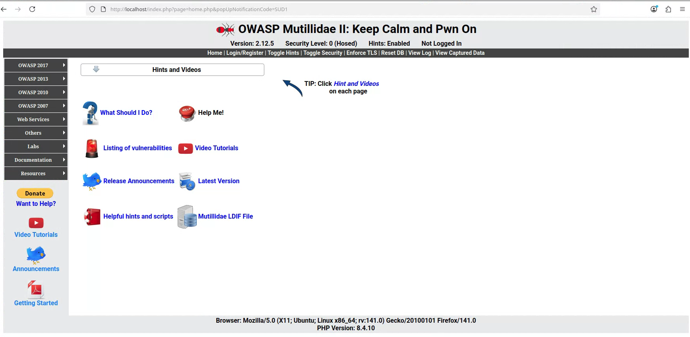
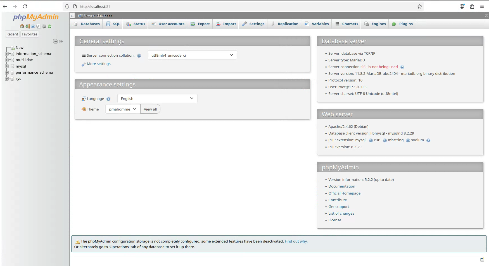
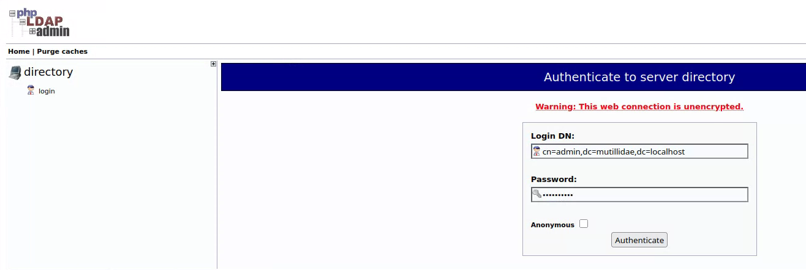
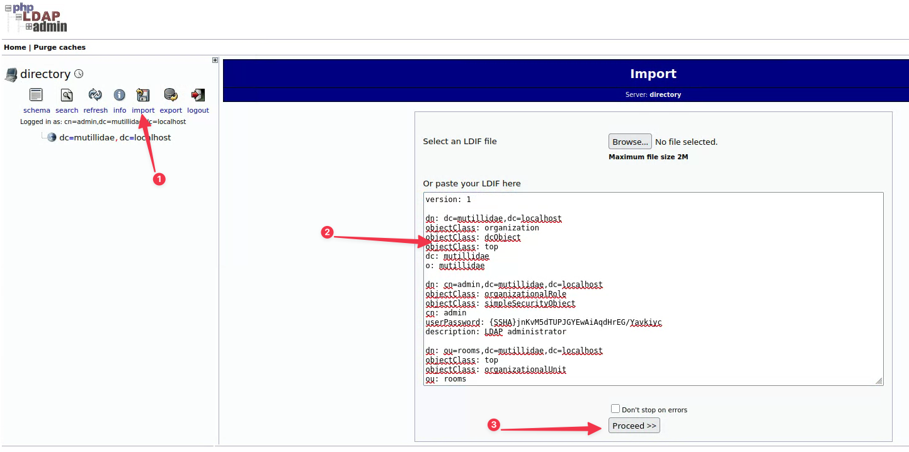
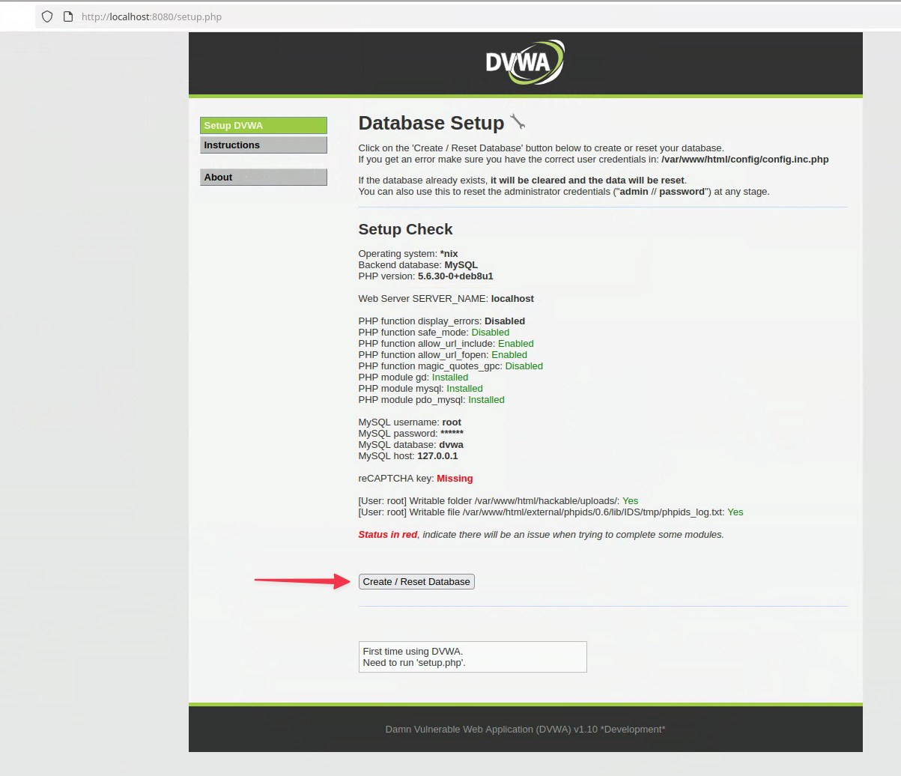

# Configuration de XUbuntu cible  

## Prérequis  

Vous pouvez utiliser la distribution Linux que vous désirez, j'utilise personnellement XUbuntu minimal.  

Pour la configuration d'une VM XUbuntu cible, vous devez avoir les applications suivantes d'installées :

```bash
sudo apt update && sudo apt install ssh git curl firefox wget neovim -y
```  
Le serveur SSH doit être actif :

```bash
sudo systemctl enable --now ssh
```  

## Installation de Docker  

Les applications vulnérables utilisées seront des conteneurs, donc vous devez installer un gestionnaire de conteneur.  

Voici l'installation de Docker.  

Ajouter les dépendances et les clés GPG officielles de Docker :

```bash
sudo apt update
sudo apt install ca-certificates
sudo install -m 0755 -d /etc/apt/keyrings
sudo curl -fsSL https://download.docker.com/linux/ubuntu/gpg -o /etc/apt/keyrings/docker.asc
sudo chmod a+r /etc/apt/keyrings/docker.asc
```  

Ajouter le dépôt officiel de Docker :  

```bash
echo \
  "deb [arch=$(dpkg --print-architecture) signed-by=/etc/apt/keyrings/docker.asc] https://download.docker.com/linux/ubuntu \
  $(. /etc/os-release && echo "${UBUNTU_CODENAME:-$VERSION_CODENAME}") stable" | \
  sudo tee /etc/apt/sources.list.d/docker.list > /dev/null
sudo apt update
```  

Installer les packages Docker :

```bash
sudo apt-get install docker-ce docker-ce-cli containerd.io docker-buildx-plugin docker-compose-plugin -y
```  

Ajouter votre utilisateur au groupe Docker :

```bash
sudo usermod -aG docker VOTRE_UTILISATEUR
```  

Vérifier l'installation :

```bash
sudo docker run hello-world
```  

## Applications vulnérables  

Nous allons ajouter les applications vulnérables **dvwa** et **mutillidae II**.  

Créer un répertoire de travail :

```bash
mkdir ~/docker
cd ~/docker
```  

Cloner le dépôt de Mutillidae II :

```bash
git clone https://github.com/webpwnized/mutillidae-dockerhub.git
```  

Déplacez-vous dans le répertoire de Mutillidae II. Éditez le fichier ```docker-compose.yml``` pour enlever toutes les entrées *127.0.0.1:* du fichier. Par exemple pour le service **database_admin** :  

```yaml
# Avant.
database_admin:
    container_name: database_admin
    depends_on:
      - database
    image: docker.io/webpwnized/mutillidae:database_admin
    ports:
      - 127.0.0.1:81:80
    networks:
      - datanet   

# Après.
database_admin:
    container_name: database_admin
    depends_on:
      - database
    image: docker.io/webpwnized/mutillidae:database_admin
    ports:
      - 81:80
    networks:
      - datanet   
```  

En enlevant les entrées *127.0.0.1:*, ça permet d'exposer l'application en dehors de l'hôte. Naturellement, ce n'est pas recommandé sur une machine qui est exposée sur un réseau public.  

Pour lancer l'application dvwa, vous allez utiliser l'image sagikazarmark/dvwa. Vous pouvez la lancer par la ligne de commande, mais je vous recommande d'utiliser un fichier Docker Compose qui va lancer dvwa et mutillidae en même temps.  

Dans le répertoire ```~/docker```, créez un fichier ```compose.yaml``` comme suit :

```yaml
# compose.yaml
---
include:    
  - mutillidae-dockerhub/docker-compose.yml

services:
  dvwa:
    image: sagikazarmark/dvwa
    ports:
      - 8080:80
    volumes:
      - dvwadb:/var/lib/mysql

volumes:
  dvwadb:
```  

Pour lancer les services, à partir du répertoire ```~/docker``` :  

```bash
docker compose up -d
```  

Une fois les applications configurées, vous pouvez arrêter et lancer vos applications avec les commandes suivantes :

```bash
docker compose stop
docker compose start
```  

## Configuration des applications  

Après le lancement des applications, vous devez faire quelques configurations.

### Configurations Mutillidae II

L'application Mutillidae II s'exécute sur le port 80, donc pour atteindre l'application vous devez ouvrir un navigateur à http://localhost.  

Au premier lancement, vous devrez configurer la base de données.

  
**Figure 1 : configuration de la DB de Mutillidae II.**  

Après la première configuration de la base de données, vous avez la page d'accueil.

  
**Figure 2 : page d'accueil de Mutillidae II.**  

Vous pouvez remettre à zéro la BD en cliquant sur **Reset DB** du menu du haut.  

Au port 81 <http://localhost:81>, vous avez la page de phpMyAdmin.  

  
**Figure 3 : phpMyAdmin.**  

Au port 82 <http://localhost:82>, vous avez la page de LDAP admin.  

  
**Figure 4 : LDAP admin.**  

Vous pouvez vous connecter en cliquant sur *login* et en utilisant les informations suivantes :  

- **Login DN** : cn=admin,dc=mutillidae,dc=localhost  
- **Password** : mutillidae  

  
**Figure 5 : LDAP admin login.**  

L'arbre du DC sera vide, vous devez importer les informations. Vous pouvez aller chercher l'information dans la configuration du github officiel ou utiliser le fichier suivant : [fichier de configuration de LDAP](extra/mutillidae.ldif).  

Vous devez cliquer sur *import*, puis copier-coller les informations contenues dans le fichier ```mutillidae.ldif```. Vous pouvez ignorer les erreurs.  

  
**Figure 6 : Importation des configurations de LDAP.**  

### Configurations DVWA  

Pour vous connecter sur l'application dvwa, vous devez aller au port 8080 : <http://localhost:8080>.  

Le nom d'utilisateur et le mot de passe sont : **admin / password**.  

Vous devez également configurer la base de données de dvwa.

  
**Figure 7 : création de la BD de dvwa.**  

Une fois la base de données créée, vous devrez vous reconnecter.  

## Applications supplémentaires

OWASP a produit quelques applications vulnérables intéressantes : OWASP Juice Shop et OWASP WebGoat.  

Voici les informations pour créer des fichiers Docker Compose pour les lancer. Vous pouvez inclure ces fichiers dans la section ```include``` du fichier ```compose.yaml```.   

### OWASP Juice Shop  

Pour lancer OWASP Juice Shop, créer un nouveau fichier pour Docker Compose, ```juice-shop-compose.yaml``` :  

```yaml
# juice-shop-compose.yaml
---
services:
  juice-shop:
    image: bkimminich/juice-shop
    ports:
      - 3000:3000
    networks:
      - juice

networks:
  juice:
```  

Pour lancer le conteneur :  

```bash
docker compose -f juice-shop-compose.yaml up -d
```  
Pour accéder à l'application, vous devez ouvrir un navigateur à <http://addresseIP:3000>.  

Pour arrêter et relancer le conteneur :  

```bash
docker compose -f juice-shop-compose.yaml stop
docker compose -f juice-shop-compose.yaml start
``` 

### OWASP WebGoat  

Pour lancer OWASP WebGoat, créer un nouveau fichier pour Docker Compose, ```webgoat-compose.yaml``` :  

```yaml
# webgoat-compose.yaml
---
services:
  webgoat:
    image: webgoat/webgoat
    ports:
      - 8090:8080
      - 9090:9090
    networks:
      - webgoat
    environment:
      TZ: Canada/Eastern

networks:
  webgoat:
```  
 **Attention 1 :** choisissez le fuseau horaire approprié (variable d'environnement TZ) afin que le conteneur Docker et votre hôte soient dans le même fuseau horaire. Ceci est important pour la validité des jetons JWT utilisés dans certains exercices.  
 **Attention 2 :** le conteneur est un peu capricieux, si la page Web ne s'affiche, arrêter le conteneur et le relancer.

Pour lancer le conteneur :  

```bash
docker compose -f webgoat-compose.yaml up -d
```  

Pour accéder à l'application, vous devez ouvrir un navigateur à <http://addresseIP:8090/WebGoat/>.  

Pour arrêter et relancer le conteneur :  

```bash
docker compose -f webgoat-compose.yaml stop
docker compose -f webgoat-compose.yaml start
``` 

Pour arrêter et effacer le conteneur :  

```bash
docker compose -f webgoat-compose.yaml down
``` 

## Références

<https://docs.docker.com/engine/install/ubuntu/>  
<https://github.com/webpwnized/mutillidae-dockerhub>  
<https://owasp.org/www-project-mutillidae-ii/>  
<https://hub.docker.com/r/sagikazarmark/dvwa>  
<https://www.youtube.com/watch?v=c1nOSp3nagw>   
<https://owasp.org/www-project-juice-shop/>  
<https://hub.docker.com/r/bkimminich/juice-shop>  
<https://owasp.org/www-project-webgoat/>  
<https://hub.docker.com/r/webgoat/webgoat>  


